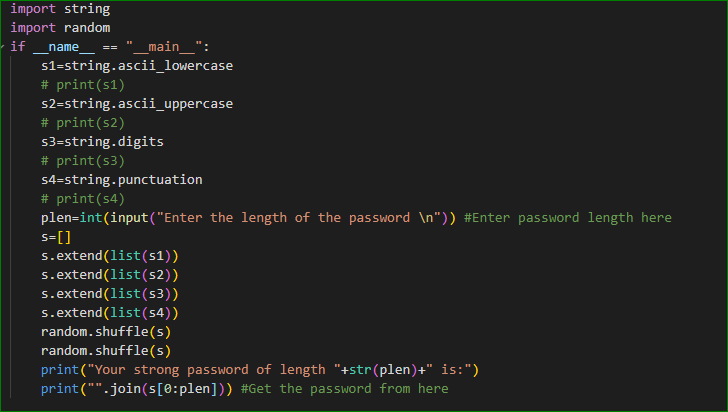
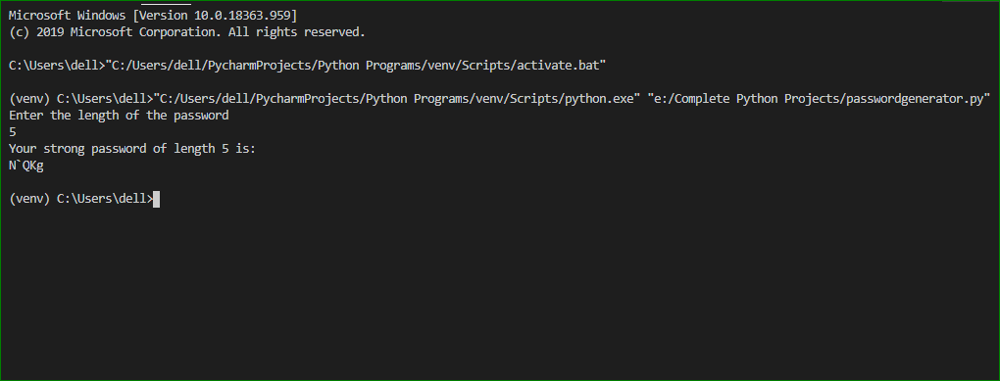

# GIT_PYTHON_RANDOM_PASSWORD_GENERATOR

#### Procedure-
1.In order to obtain the strong password, you must have the following code. (As shown in figure) 
 
 
2.Secondly, All you have to do that you have to execute the code and enter the length of the password as you want and simply hit enter. You will get the strong password of desired length at that instant. (As shown in figure) 
 

